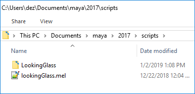
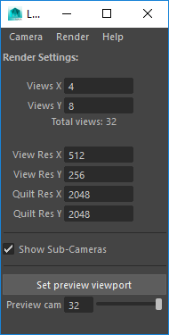
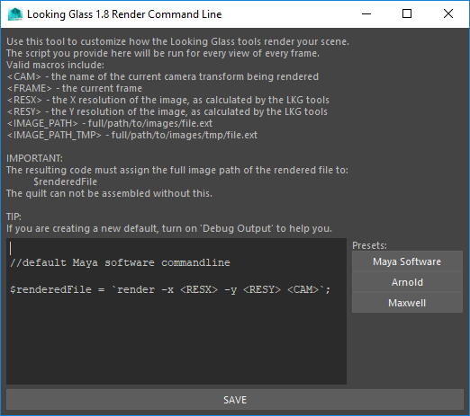

# MayaSDK_Issues
A repository for feature requests and bug reporting for the Looking Glass Maya SDK in closed beta. This repository does not contain any source code. *The Maya SDK has been shelved until we have resources to improve it.*

# INSTRUCTIONS:
This tutorial is intended for use with the closed beta of the Maya SDK. If you'd like to sign up for the closed beta, please fill out [this form](https://docs.google.com/forms/d/1UDvp7AX4X1Jf16kTyROBbMfhXN-AEiqrrCkR7-9CzOE/).

*Last Updated: January 28, 2019*
*Version: 3.61*

The Looking Glass Maya SDK lets you preview your scene in real-time in the [Looking Glass](https://lookingglassfactory.com/product/looking-glass/), and render content for the Looking Glass using the renderer of your choice (Native, [Arnold](https://www.arnoldrenderer.com/), and [Maxwell](http://www.nextlimit.com/maxwell) are supported out of the box) due to a customizable render command line.   

_The SDK is currently only available for Maya on Windows._

## Installation

  - Download ZIP folder containing SDK. 
  - Extract the files from the zip and copy them into `C:/Users/<username>/Documents/maya/20xx/scripts/`. If you're script folder is not located here, you can run "internalVar -usd" within Maya to find its location.
  - Open Maya and run the MEL command **lookingGlass**.

## Using the SDK

   
_The Looking Glass SDK window_

### **Previewing INSIDE a Looking Glass:**
  - Ensure the USB and HDMI of your Looking Glass are connected to your computer
  - **Recommended:** Check that your monitors are set to "Extend these displays" (**not** duplicate displays) in Windows Display Settings. It is recommended to put the Looking Glass on the **LEFT**.
  - Create a Looking Glass camera: _Camera > Create Looking Glass Camera_
  - Select a Looking Glass Camera (not it's sub cameras)
  - *Camera > Real Time Previewer > Preview Selected Camera in the Looking Glass*

**NOTE!**  If you see an **ORANGE SCREEN** in the viewport, set:   
>*Windows > Settings/Preferences > Preferences > Display Tab > Viewport 2.0 Rendering Engine to **OpenGL Core Profile***

**To center your view**, use *Camera > Real Time Previewer > Toggle Centering Guides*, and drag your window around until the view is centered.  Keep in mind that making your window too large will greatly impact Maya's real-time performance.

### **Previewing WITHOUT a Looking Glass:**    
  - Create a Looking Glass camera: _Camera > Create Looking Glass Camera_
  - Highlight a viewport
  - Press **Set preview viewport** button
  - Use the slider to see exactly what each view will look like when it renders

**SDK Notes:**

- The tools have only been tested to support jpg, png, and exr image render formats.  Other formats may not work properly during the quilting process, or other part of the pipeline.
- The tools **override and change the Global Render Settings** to match whatever quilt settings you provide. 
- If you want something to occur on all cameras, set it on the main Looking Glass camera and it will be propagated.  If this doesn't work, modify *kg_connectSubCamera()* in lookingGlass.mel
- Using the rendering menu in the Looking Glass tools will manage and name views properly (turn them into [quilts](../../HoloPlayCAPI/guides/quilt)) for you, rather than the default Maya rendering tools.
- Turning on *Help > Debug Output* will output the exact command lines used when rendering, should you want to customize this.
- If you are rendering with a render farm and not with the Looking Glass tools, it is recommended to use *Camera > Toggle .renderable on subcameras*.  The quilts can then be assembled later with post processing software (ie Nuke) or our quilt processing tools.

  
  
## Rendering locally with a non-native renderer

If you want to use the Looking Glass tools (as opposed to a render farm or other) to render your scene, but also want to use a non-native renderer do: *Render > Customize Render Commandline*

You will then be shown the render command line customization tool:

Click a button on the right for the corresponding preset.  However, if your desired renderer is not included, you can write in your own.  **The most important part of the script is that the variable $renderedFile contain the exact path to the rendered file.**  Then, the tools can rename the file and process it as appropriate.

Press *Save*

## Rendering with a Render Farm

There are 2 features designed to help make your life easier if you want to render the views through a render farm:

1. ***Camera > Toggle .renderable on sub cameras:***

	Toggles **.renderable** on all sub cameras.  Some render farms use this attribute to figure out what cameras to use.

1. ***Camera > Disassemble/Assemble Looking Glass Camera:***

	When this tool is run on a Looking Glass camera, it removes all expressions, and linkages from the main
	camera to it's sub cameras, leaving the sub cameras as normal regular Maya cameras with their most recent settings, and allowing them to be unparented or modified in any normal way 
	(settings on the Looking Glass camera will be left locked, so you can recreate what you last had when it was disassembled).
	
	The Looking Glass camera can be re-assembled by running this tool on it again.
	Note that when it disassembles, it will leave you with the sub cameras selected (in case you want unparent them).
	When it assembles, it will leave you with the respective Looking Glass camera selected.
	
Keep in mind that if you render using a farm, you will have to manage the individual rendered view frames, and convert them into quilts for them to be
useable in the Looking Glass.  This can be done using post processing software like Nuke, or with [quilt](../../HoloPlayCAPI/guides/quilt) management tools provided by Looking Glass.
